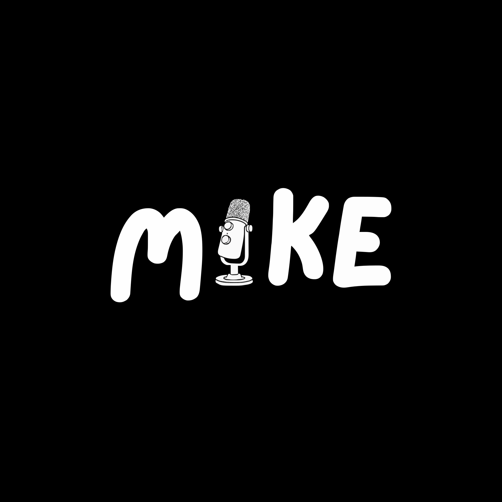

<div align="center">



# Mike

**AI-powered voice dictation for Windows — speak anywhere, instantly.**

[](https://python.org)
[](https://groq.com)
[](https://openai.com/research/whisper)
[](https://microsoft.com/windows)
[](LICENSE)

</div>

---

## What is Mike?

Mike is a **global voice dictation engine** that runs in the Windows system tray and transcribes speech into the application currently under your cursor — browser, editor, email, Slack, and more.

It uses **Groq Whisper** for speech-to-text and can optionally pass the result through an LLM polishing step before inserting the text.

## Features

| Feature | Details |
|---|---|
| Push-to-Talk | Hold `Ctrl+Shift`, speak, release — text appears at the cursor |
| Continuous Mode | Toggle `Ctrl+Shift+Space` for chunked continuous transcription |
| AI Polishing | Raw, Semi-formal, and Polished output modes |
| Symbol Expansion | Spoken phrases such as “degree symbol” become `°` |
| Floating HUD | Recording / processing state and waveform feedback |
| Dashboard | History, statistics, and settings |
| Startup | Can register itself to launch with Windows |
| Tray App | Runs without a visible terminal window |

## Dictation modes

- **RAW** — minimal post-processing.
- **SF / Semi-formal** — grammar cleanup and filler removal.
- **POL / Polished** — stronger AI rewrite for cleaner final prose.

## Requirements

- Windows 10 or Windows 11
- Python 3.11+ when building from source
- A working microphone
- A Groq API key

## Install from source

```bash
git clone https://github.com/h55n/mike.git
cd mike
cp config.example.json config.json
```

Add your Groq API key to your local configuration, then run:

```powershell
powershell -ExecutionPolicy Bypass -File build_and_install.ps1
```

The build script installs dependencies, generates assets, packages `Mike.exe` with PyInstaller, creates shortcuts, and registers startup behavior.

## Releases

Pre-built binaries, when published, are available from the repository Releases page:

https://github.com/h55n/mike/releases

Do not download binaries from placeholder or third-party repository URLs.

## How it works

```text
You speak
    ↓
Microphone capture (16 kHz mono)
    ↓
Voice Activity Detection / RMS filtering
    ↓
Groq Whisper transcription
    ↓
Text cleanup + symbol expansion
    ↓
Optional LLM polish
    ↓
Clipboard / keyboard injection at the active cursor
```

## Architecture

| File | Role |
|---|---|
| `main.py` | Entry point, startup flags, single-instance lock, orchestration |
| `engine.py` | IDLE / PTT / CONTINUOUS / PROCESSING state machine |
| `hotkeys.py` | Global hotkey handling |
| `audio.py` | Microphone capture, VAD, WAV encoding |
| `transcription.py` | Groq Whisper client |
| `ai.py` | Optional LLM polishing |
| `filters.py` | Text cleaning and symbol expansion |
| `injection.py` | Clipboard / keyboard text injection |
| `hud.py` | Floating recording HUD |
| `dashboard.py` | PyQt6 dashboard |
| `tray.py` | System tray integration |
| `db.py` | SQLite history |
| `startup.py` | Windows startup registration |

## Configuration

Mike stores its local configuration under the user profile. A typical configuration contains:

```json
{
  "groq_api_key": "gsk_...",
  "default_mode": "semi_formal",
  "hud_opacity": 0.85,
  "continuous_chunk_seconds": 5,
  "transcription_language": "en",
  "inject_method": "clipboard"
}
```

Never commit a real API key. `config.json` should remain local-only.

## Common hotkeys

| Action | Hotkey |
|---|---|
| Push-to-Talk | `Ctrl + Shift` |
| Toggle Continuous Mode | `Ctrl + Shift + Space` |
| Open Dashboard | Tray icon → Dashboard |

## Build dependencies

The Python application uses packages including Groq, pynput, PyQt6, pystray, sounddevice, SciPy, NumPy, pyautogui, cairosvg, Pillow, and PyInstaller. See `requirements.txt` for the authoritative dependency list.

## Uninstall

```powershell
powershell -ExecutionPolicy Bypass -File uninstall.ps1
```

## License

MIT — see [LICENSE](LICENSE).

<div align="center">

**Made by h55n**

</div>
